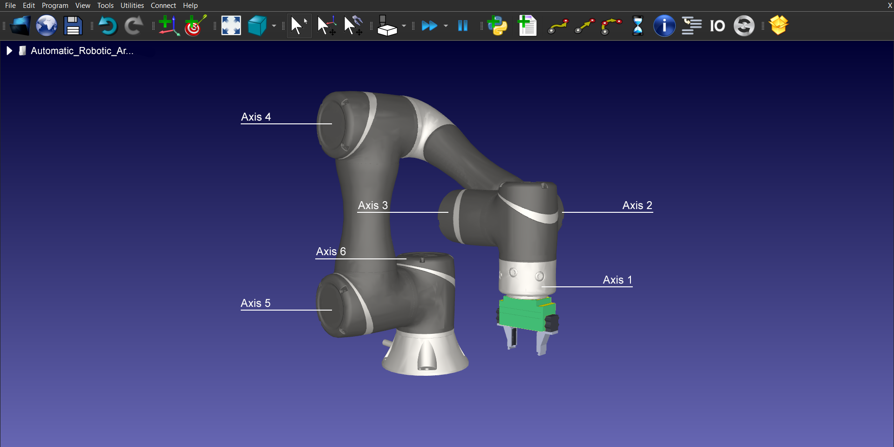

# Automatic-Robotic-Arm
## Arduino based 6 axis robotic arm

Imagine a highly precise and versatile robotic arm that can move with six degrees of freedom, effortlessly manipulating objects in any direction with pinpoint accuracy. This is the beauty of a 6 axis robotic arm, which has been built using the powerful combination of Arduino and RoboDK.

With its sleek design and state-of-the-art technology, this robotic arm can perform a wide range of tasks, from intricate assembly operations to material handling. The Arduino microcontroller provides a reliable and flexible control system, while RoboDK's advanced simulation software allows for seamless programming and virtual testing of complex tasks.

Equipped with servo motors, stepper motors and sensors, this robotic arm can swiftly move through its six axes, effortlessly lifting and manipulating objects with precision and efficiency. Its end effector can be customized to suit various applications, including gripping, welding, or even painting.

This project is the implementation of a 6 axis robotic arm which can be rotated to any direction manually or automatically.
The automated feature is brought into play with the help of obstacle sensing mechanism. Ultrasonic sensors are used to detect
obstacles. When the obstacle comes within the prescribed radius, it gets sensed with the help of the ultrasonic sensor and 
that object is picked by the arm.
